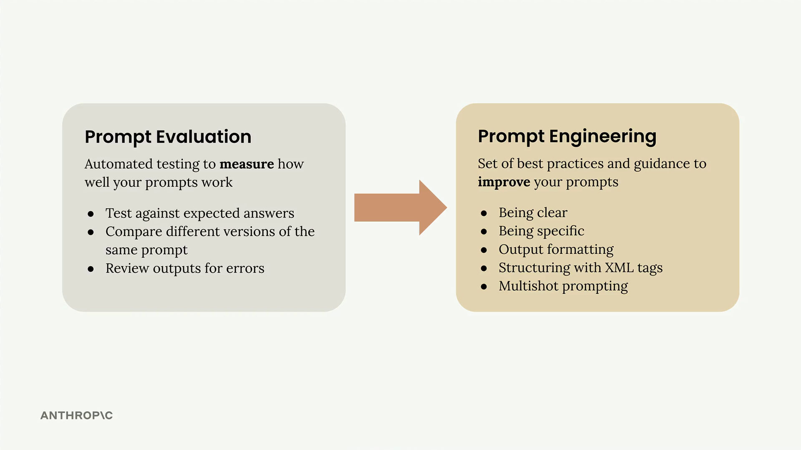
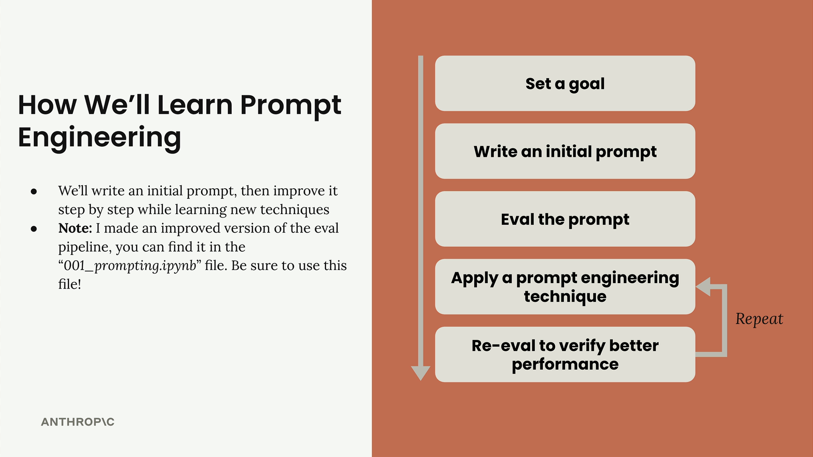

# Prompt engineering

Prompt engineering is about taking a prompt you've written and improving it to get more reliable, higher-quality outputs. This process involves iterative refinement - starting with a basic prompt, evaluating its performance, then systematically applying engineering techniques to improve it.


## The Iterative Improvement Process
The approach follows a clear cycle that you can repeat until you achieve your desired results:


*  1 Set a goal - Define what you want your prompt to accomplish
* 2 Write an initial prompt - Create a basic first attempt
* 3 Evaluate the prompt - Test it against your criteria
* 4 Apply prompt engineering techniques - Use specific methods to improve performance
* 5 Re-evaluate - Verify that your changes actually improved the results

You repeat the last two steps until you're satisfied with the performance. Each iteration should show measurable improvement in your evaluation scores.

## Being Clear and Direct
When crafting that crucial first line, you want to focus on two key principles: clarity and directness. This means using simple language that leaves no room for ambiguity about what you want Claude to do.

### Clear Communication
Being "clear" means:

* **Use simple language** that anyone can understand.
* **State exactly what you want** without beating around the bush.
* **Lead with a straightforward statement** of Claude's task.

> **Example:** Instead of writing something vague like *"I need to know about those things people put on their roofs that use sun - those solar panel things, I think they're called,"* be direct and write: **"Write three paragraphs about how solar panels work."**

### Direct Instructions
Being "direct" focuses on how you structure your request:

* Use instructions, not questions
* Start with direct action verbs like **"Write,"** **"Create,"** or **"Generate"**
> **Example:** Rather than asking "I was reading about renewable energy and geothermal energy sounds neat. What countries use it?" try: "Identify three countries that use geothermal energy. Include generation stats for each."

## Being Specific

When working with Claude, one of the most effective ways to improve your results is to be specific about what you want. Instead of leaving everything up to the model's interpretation, you can provide clear guidelines or steps that direct Claude toward the kind of output you're looking for.

Think about it this way: if you ask Claude to *"write a short story about a character who discovers a hidden talent,"* Claude could go in countless directions. The story might be 200 words or 2,000 words. It might have one character or five. It could focus on any type of talent discovery scenario.

By adding specific guidelines, you give Claude a clearer target to aim for. This dramatically improves both the consistency and quality of the output.

---

### Two Types of Guidelines

There are two main approaches to being specific in your prompts, and you'll often see them used together in professional applications.

#### Output Quality Guidelines
The first type focuses on listing qualities that your output should have. These guidelines help you control:
* Length of the response
* Structure and format
* Specific attributes or elements to include
* Tone or style requirements

> **Example:** You might specify that a story should be under 1,000 words, include a clear action that reveals the character's talent, and feature at least one supporting character.

#### Process Steps
The second type provides specific steps for Claude to follow. This approach is particularly useful when you want Claude to think through a problem systematically or consider multiple perspectives before arriving at a final answer.

Instead of jumping straight to writing, you might ask Claude to:
1. Brainstorm three talents that would create dramatic tension
2. Pick the most interesting talent
3. Outline a pivotal scene that reveals the talent
4. Brainstorm supporting character types that could increase the impact

---

### When to Use Each Approach

Here's a practical guide for when to use each type of specificity:

#### Always Use Output Guidelines
You should include quality guidelines in almost every prompt you write. They're your safety net for getting consistent, useful results.

#### Use Process Steps For Complex Problems
Add step-by-step instructions when you're dealing with:
* Troubleshooting complex problems
* Decision-making scenarios
* Critical thinking tasks
* Any situation where you want Claude to consider multiple angles

> **Example:** If you're asking Claude to analyze why a sales team's performance dropped, you'd want to guide it through examining market metrics, industry changes, individual performance, organizational changes, and customer feedback — rather than letting it focus on just one potential cause.

---

### Combining Both Approaches

In professional prompting, you'll often see both techniques used together. You might have guidelines that control the format and content of your output, plus steps that ensure Claude thinks through the problem thoroughly before responding.

This combination gives you both consistency in your results and confidence that Claude has considered all the important factors in reaching its conclusion.


## Structure with XML Tags

When you're building prompts that include a lot of content, Claude can sometimes struggle to understand which pieces of text belong together or what different sections are supposed to represent. XML tags provide a simple way to add structure and clarity to your prompts, especially when you're interpolating large amounts of data.

# Providing Structure

---

## Not Great

```xml
Debug my code below using the provided documentation.

from datavortex import Pipeline, DataSource

def process_data(input_file, output_file):
    pipeline = Pipeline()
    source = DataSource.from_csv(input_file)
    
# Creating a data source from data vortex
csv_source = DataSource.from_csv("data.csv")
```
## BETTER
```xml
Debug my code below using the provided documentation.

<my_code>
from datavortex import Pipeline, DataSource

def process_data(input_file, output_file):
pipeline = Pipeline()
source = DataSource.from_csv(input_file)
</my_code>

<docs>
# Creating a data source from data vortex
csv_source = DataSource.from_csv("data.csv")
</docs>
```
---

### Why Structure Matters

Consider a prompt where you need to analyze 20 pages of sales records. Without clear boundaries, Claude might have trouble distinguishing between your instructions and the actual data you want analyzed.

Unclear boundaries can make it difficult for Claude to parse your intent. By wrapping the sales records in XML tags like `<sales_records>` and `</sales_records>`, you create clear delimiters that help Claude understand the structure of your prompt.

---

### When to Use XML Tags

XML tags are most useful when:
* Including large amounts of context or data
* Mixing different types of content (e.g., code, documentation, data)
* You want to be extra clear about content boundaries
* Working with complex prompts that interpolate multiple variables

> **Tip:** Even for shorter content, XML tags can help serve as delimiters that make your prompt structure more obvious to Claude.

---


## Providing Examples

Providing examples in your prompts is one of the most effective prompt engineering techniques you'll use. This approach, known as **"one-shot"** or **"multi-shot"** prompting, involves giving Claude sample input/output pairs to guide its responses.

---

### How Examples Work

Let's look at a sentiment analysis example. Say you want Claude to categorize whether a tweet is positive or negative:

The challenge here is sarcasm. A tweet like *"Yeah, sure, that was the best movie I've seen since 'Plan 9 from Outer Space'"* appears positive on the surface, but it's actually sarcastic and negative (*Plan 9* is famously one of the worst movies ever made).

---

### Adding Examples to Handle Corner Cases

To solve this, you can add examples that show Claude how to handle tricky cases. An improved prompt might include:

* A clear positive example: `"Great game tonight!"` $\rightarrow$ `"Positive"`
* A sarcastic example: `"Oh yeah, I really needed a flight delay tonight! Excellent!"` $\rightarrow$ `"Negative"`
* Context explaining why sarcasm should be treated carefully

Notice how the examples are wrapped in XML tags like `<sample_input>` and `<ideal_output>`. This structure makes it crystal clear to Claude what each part represents.

---

### When to Use Examples

Examples are particularly useful for:

* Capturing corner cases or edge scenarios
* Defining complex output formats (like specific JSON structures)
* Showing the exact style or tone you want
* Demonstrating how to handle ambiguous inputs

---

### One-Shot vs Multi-Shot

* **One-Shot:** Provide a single example to establish the pattern.
* **Multi-Shot:** Provide multiple examples to cover different scenarios.

> **Tip:** Use multi-shot when you need to handle various edge cases or want to show different types of valid responses.

---

### Finding Good Examples from Evaluations

When running prompt evaluations, look for your highest-scoring outputs to use as examples:

Find responses that scored 10 (or your highest available score) and use those input/output pairs as examples in your prompt. This helps Claude understand what "perfect" output looks like for your specific use case.

---

### Adding Context to Examples

Don't just provide the input/output pair — explain *why* the output is good:

```xml
<ideal_output>
[Your example output here]
</ideal_output>
```

### Best Practices
* Always use XML tags to structure your examples clearly
* Be explicit about what you're showing: "Here is an example input with an ideal response"
* Include examples that address your most common failure cases
* Explain why your example outputs are considered ideal
* Keep examples relevant to your specific task
* Examples are especially powerful because they show rather than tell. Instead of trying to describe exactly what you want in words, you demonstrate it directly. This makes your prompts much more reliable and helps Claude understand subtle requirements that might be hard to express in instructions alone.