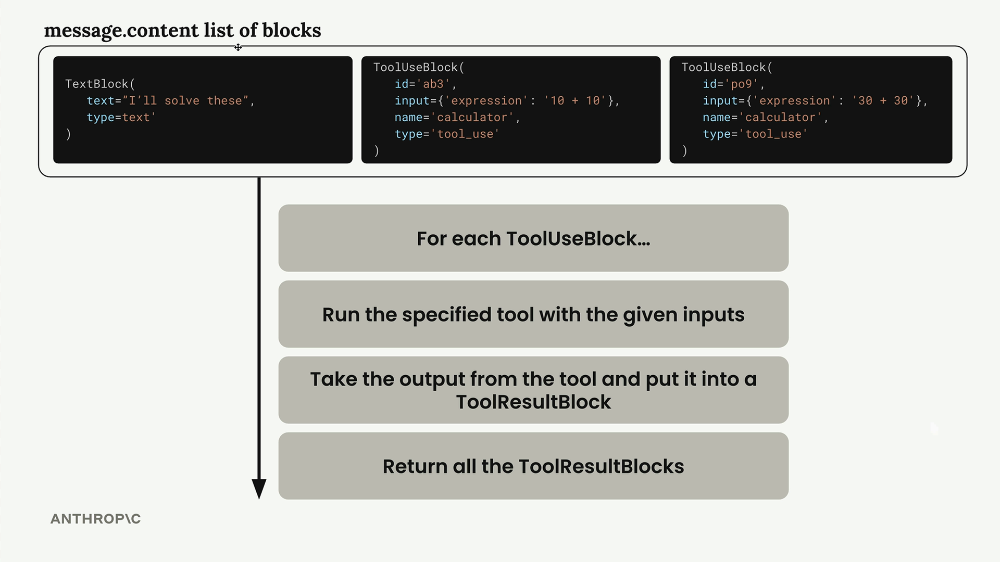

## The Simple Pattern for Adding Tools
Once you have the core tool infrastructure, adding new tools follows this pattern:

* Create the tool function implementation
* Define the tool schema
* Add the schema to the tools list in run_conversation
* Add a case for the tool in run_tool

This modular approach makes it easy to expand your AI assistant's capabilities without restructuring existing code. Each new tool integrates seamlessly with the existing conversation flow and tool-handling logic.

## Tool schemas
After writing your tool function, the next step is creating a JSON schema that tells Claude what arguments your function expects and how to use it. This schema acts as documentation that Claude reads to understand when and how to call your tools

The complete tool specification has three main parts:

* **name** - A clear, descriptive name for your tool (like "get_weather")
* **description** - What the tool does, when to use it, and what it returns
  * Aim for 3-4 sentences explaining what the tool does
  * Describe when Claude should use it
  * Explain what kind of data it returns
  * Provide detailed descriptions for each argument 
* **input_schema** - The actual JSON schema describing the function's arguments

> **Tip:** ask model "Write a valid JSON schema spec for the purposes of tool calling for this function. Follow the best practices listed in the attached documentation."

## Understanding Multi-Block Messages
When Claude decides to use a tool, it returns an assistant message with multiple blocks in the content list. This is a significant change from the simple text-only responses you've worked with before.

A multi-block message typically contains:

* **Text Block** - Human-readable text explaining what Claude is doing (like "I can help you find out the current time. Let me find that information for you")
* **ToolUse Block** - Instructions for your code about which tool to call and what parameters to use
The ToolUse block includes:
* An ID for tracking the tool call
* The name of the function to call (like "get_current_datetime")
* Input parameters formatted as a dictionary
*The type designation "tool_use"

## Tool Result Block
After running the tool function, you need to send the results back to Claude using a tool result block. This block goes inside a user message and tells Claude what happened when you executed the tool.

The tool result block has several important properties:

* **tool_use_id** - Must match the id of the ToolUse block that this ToolResult corresponds to
* **content** - Output from running your tool, serialized as a string
* **is_error** - True if an error occurred
* **type** - **tool_result**

## Handling Multiple Tool Calls
Claude can request multiple tools in a single response. The message content contains a list of blocks, and we need to process each tool use block separately:

