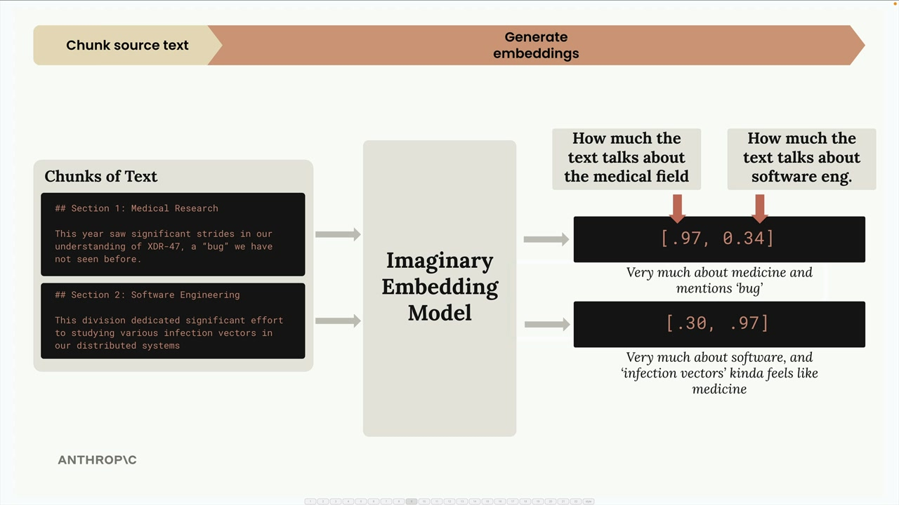
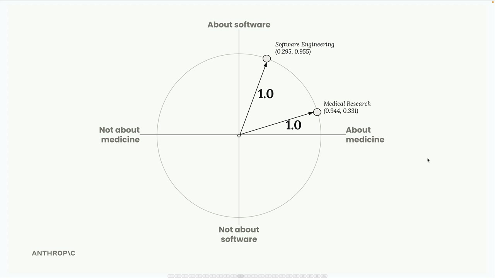
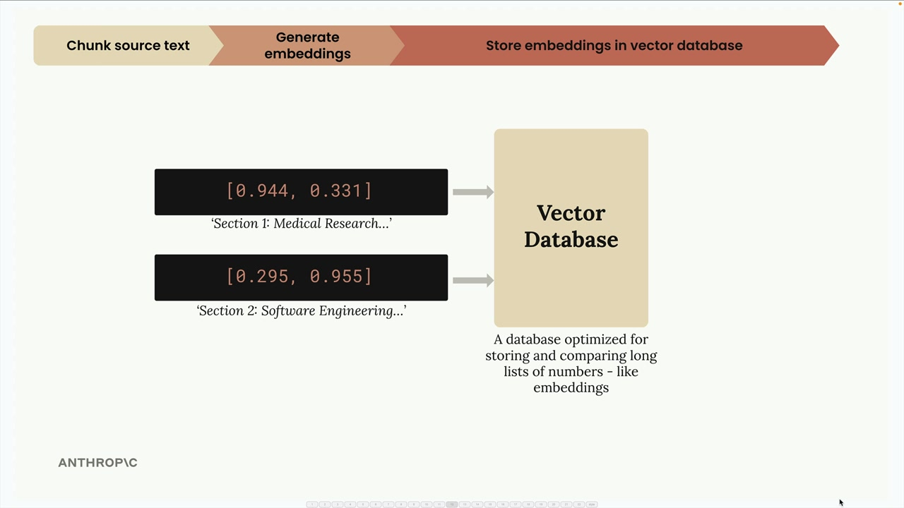
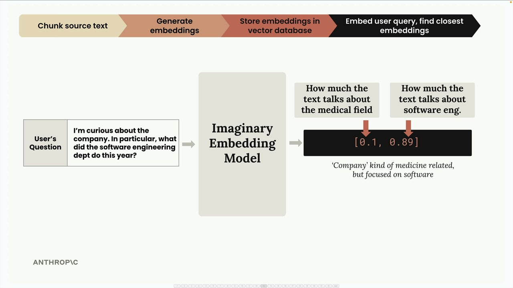
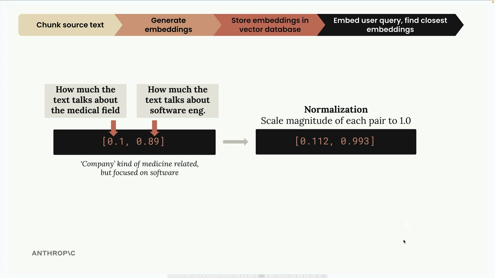
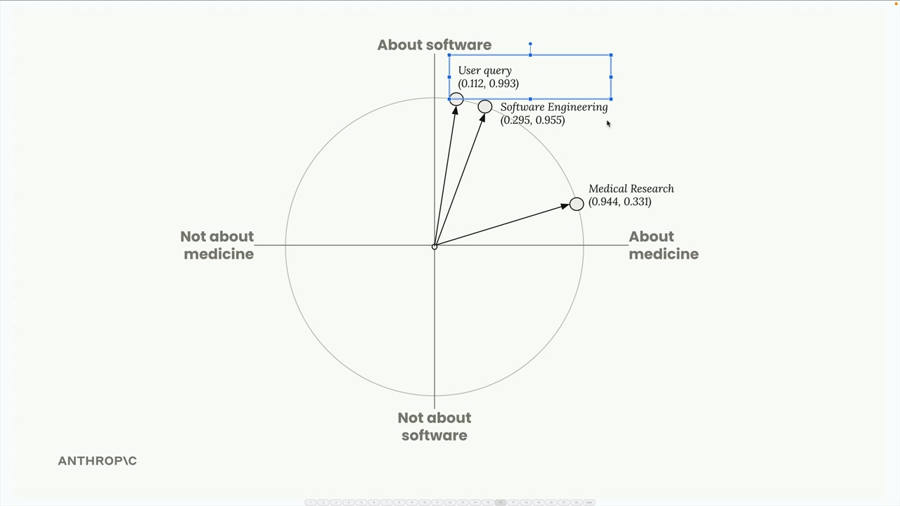
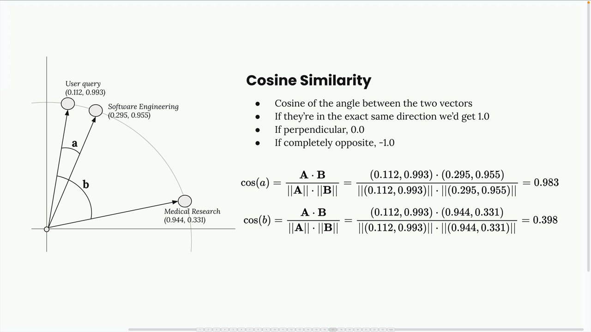

# RAG

## RAG flow

### Step 1: Chunk Your Source Text
First, we take our source document and break it into manageable chunks. For this example, we'll use two simple text sections:

* Section 1: Medical Research - "This year saw significant strides in our understanding of XDR-47, a 'bug' we have not seen before."
* Section 2: Software Engineering - "This division dedicated significant effort to studying various infection vectors in our distributed systems"

### Step 2: Generate Embeddings
Next, we convert each text chunk into numerical embeddings using an embedding model. To make this easier to understand, let's imagine we have a perfect embedding model that always returns exactly two numbers, and we know what each number represents.


In our imaginary model:

* The first number represents how much the text talks about the medical field
* The second number represents how much the text talks about software engineering

For the medical research section, we might get [0.97, 0.34] - very medical-focused but with some software elements due to the word "bug". For the software engineering section, we get [0.30, 0.97] - heavily software-focused but with medical undertones from "infection vectors".

### Normalization
The embedding API typically performs a normalization step that scales each vector to have a magnitude of 1.0. You don't need to worry about the math here - it's handled automatically. This gives us normalized vectors like [0.944, 0.331] and [0.295, 0.955].


### Step 3: Store in Vector Database
We store these embeddings in a vector database - a specialized database optimized for storing, comparing, and searching through long lists of numbers like our embeddings.


### Step 4: Process User Query
When a user asks a question like **"I'm curious about the company. In particular, what did the software engineering dept do this year?"**, we run their query through the same embedding model.



This query gets embedded as something like [0.1, 0.89] - low medical score, high software engineering score. After normalization, we get [0.112, 0.993].


### Step 5: Find Similar Embeddings
We send the user's query embedding to our vector database and ask it to find the most similar stored embeddings.

The database returns the software engineering section because it's the closest match to what the user asked about.

#### Cosine Similarity
The vector database uses cosine similarity to determine which embeddings are most similar. This measures the cosine of the angle between two vectors.


Key points about cosine similarity:
* Results range from -1 to 1
* Values close to 1 mean high similarity
* Values close to -1 mean very different
* 0 means perpendicular (no relationship)

In our example, the cosine similarity between the user query and the software engineering chunk is 0.983 - very high similarity. The similarity with the medical research chunk is only 0.398 - much lower.

#### Cosine Distance
You'll often see "cosine distance" in vector database documentation. This is simply calculated as (1 - cosine similarity). With cosine distance:

* Values close to 0 mean high similarity
* Larger values mean less similarity

This adjustment makes the numbers easier to interpret in many contexts.

### Step 6: Create the Final Prompt
Finally, we take the user's question and the most relevant text chunk we found, combine them into a prompt, and send it to Claude for a response.


## Benefits of RAG
* Claude can focus on only the most relevant content
* Scales up to very large documents
* Works with multiple documents
* Smaller prompts cost less and run faster

## Challenges with RAG
* Requires a preprocessing step to chunk documents
* Need a search mechanism to find "relevant" chunks
* Included chunks might not contain all the context Claude needs
* Many ways to chunk text - which approach is best?

For example, you could split documents into equal-sized portions, or you could create chunks based on document structure like headers and sections. Each approach has trade-offs you'll need to evaluate for your specific use case.

## When to Use RAG
RAG involves many technical decisions and requires more work than simply including everything in a prompt. You'll need to analyze whether the benefits outweigh the complexity for your particular application. It's especially valuable when working with very large documents, multiple documents, or when you need to optimize for cost and performance.

The key insight is that RAG trades simplicity for scalability and efficiency. While it requires more upfront work to implement properly, it enables you to work with document collections that would be impossible to handle with simple prompt stuffing.


## Chunking
### Choosing Your Strategy
Your choice depends entirely on your use case and document guarantees:

* **Structure-based**: Best results when you control document formatting (like internal company reports)
* **Sentence-based**: Good middle ground for most text documents
* **Size-based**: Most reliable fallback that works with any content type, including code

Size-based chunking with overlap is often the go-to choice in production because it's simple, reliable, and works with any document type. While it may not give perfect results, it consistently produces reasonable chunks that won't break your pipeline.

> Remember: there's no single "best" chunking strategy. The right approach depends on your specific documents, use cases, and the trade-offs you're willing to make between implementation complexity and chunk quality.

## Semantic search
The most common approach for finding relevant chunks is semantic search. Unlike keyword-based search that looks for exact word matches, semantic search uses text embeddings to understand the meaning and context of both the user's question and each text chunk.

### Text Embeddings
A text embedding is a numerical representation of the meaning contained in some text. Think of it as converting words and sentences into a format that computers can work with mathematically.
Here's how the process works:

* You feed text into an embedding model
* The model outputs a long list of numbers (the embedding)
* Each number ranges from -1 to +1
* These numbers represent different qualities or features of the input text
#### Understanding the Numbers
  Each number in an embedding is essentially a "score" for some quality of the input text. However, here's the important caveat: we don't know precisely what each number represents.
  

## BM25 lexical search
When building RAG pipelines, you'll quickly discover that semantic search alone doesn't always return the best results. Sometimes you need exact term matches that semantic search might miss. The solution is to combine semantic search with lexical search using a technique called BM25.

BM25 (Best Match 25) is a popular algorithm for lexical search in RAG systems. Here's how it processes a search query:


### Step 1: Tokenize the query
Break the user's question into individual terms. For example, "a INC-2023-Q4-011" becomes ["a", "INC-2023-Q4-011"].

### Step 2: Count term frequency
See how often each term appears across all your documents. Common words like "a" might appear 5 times, while specific terms like "INC-2023-Q4-011" might appear only once.

### Step 3: Weight terms by importance
Terms that appear less frequently get higher importance scores. The word "a" gets low importance because it's common, while "INC-2023-Q4-011" gets high importance because it's rare.

### Step 4: Find best matches
Return documents that contain more instances of the higher-weighted terms.


## Understanding Reciprocal Rank Fusion
Merging results from different search methods isn't as simple as just concatenating lists. Each method uses different scoring systems, so we need a way to normalize and combine their rankings fairly.


Here's how reciprocal rank fusion works with an example. Let's say we search for information about "INC-2023-Q4-011" and get these results:

* VectorIndex returns: Section 2 (rank 1), Section 7 (rank 2), Section 6 (rank 3)
* BM25Index returns: Section 6 (rank 1), Section 2 (rank 2), Section 7 (rank 3)

We combine these into a single table showing each text chunk's rank from both indexes, then apply the RRF formula:
```acl
RRF_score(d) = Σ(1 / (k + rank_i(d)))
```
Where k is a constant (often 60, but we'll use 1 for clearer results) and rank_i(d) is the rank of document d in the i-th ranking.


The final ranking becomes: Section 2 (0.833), Section 6 (0.75), Section 7 (0.583). This makes intuitive sense - Section 2 performed well in both indexes, so it rises to the top.
