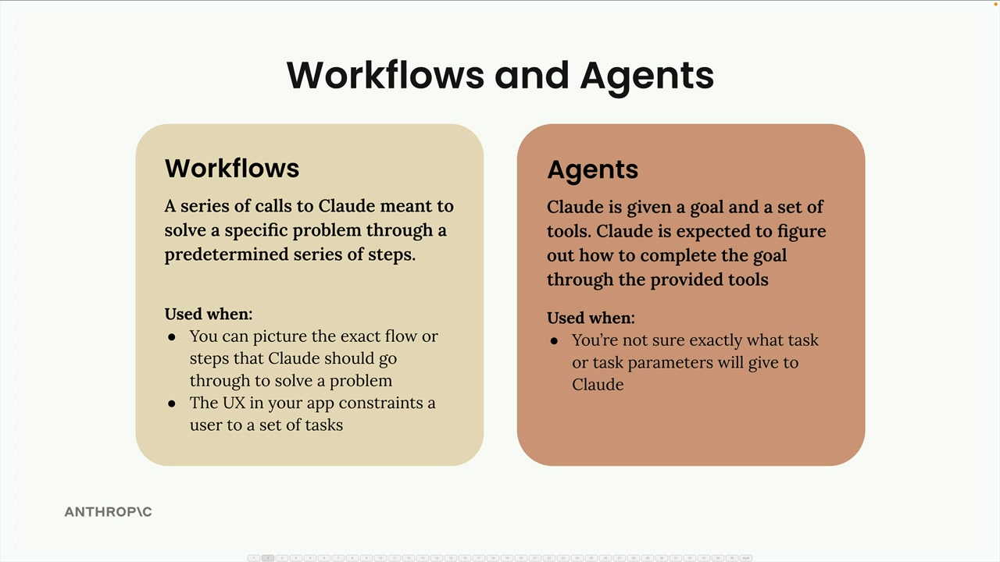

# Workflows vs Agents

The decision comes down to how well you understand the task:

* Use workflows when you can picture the exact flow or steps that Claude should go through to solve a problem, or when your app's UX constrains users to a set of tasks
* Use agents when you're not sure exactly what task or task parameters you'll give to Claude

## Workflows
Workflows are a series of calls to Claude meant to solve a specific problem through a predetermined series of steps. Agents give Claude a goal and a set of tools, expecting Claude to figure out how to complete the goal through the provided tools.

### The Evaluator-Optimizer Pattern

This modeling workflow is an example of an evaluator-optimizer pattern. Here's how it works:

* Producer: Takes input and creates output (Claude using CadQuery to model the part and create a rendering)
* Grader: Evaluates the output against some criteria
* Feedback loop: If the grader doesn't accept the output, feedback goes back to the producer for improvement
* Iteration: The cycle repeats until the grader accepts the output

### Parallelization workflows
* Split a single task into multiple sub-tasks - Break down the complex decision into focused, specialized evaluations
* Run the sub-tasks in parallel - Execute all evaluations simultaneously for faster processing
* Aggregate the results together - Combine the specialized analyses into a final decision
* The parallelized sub-tasks don't need to be identical - Each can have a specialized prompt, set of tools, or evaluation criteria

#### Benefits of This Approach
Parallelization workflows offer several key advantages:

* Focused attention: Claude can concentrate on one specific aspect at a time rather than trying to balance multiple competing considerations simultaneously. This leads to more thorough and accurate analysis for each material type.
* Easier optimization: You can improve and test the prompts for each material evaluation independently. If your metal analysis isn't working well, you can refine just that prompt without affecting the others.
* Better scalability: Adding new materials to evaluate is straightforward - just add another parallel request. You don't need to rewrite existing prompts or worry about how the new criteria might interfere with existing ones.
* Improved reliability: By breaking down the complex task, you reduce the cognitive load on the AI model and get more consistent, reliable results.

#### When to Use Parallelization
This pattern works well when you have a complex decision that can be broken down into independent evaluations. Look for situations where you're asking an AI to consider multiple criteria, compare several options, or make decisions that involve different domains of expertise.

The key is identifying tasks that can be meaningfully separated - each parallel sub-task should be able to operate independently and contribute a distinct piece of analysis to the final decision.

### Chaining workflows
A chaining workflow breaks down a large, complex task into smaller, sequential subtasks. Instead of asking Claude to do everything at once, you split the work into focused steps that build on each other.

The chaining approach offers several advantages:

* Split large tasks into smaller, non-parallelizable subtasks
* Optionally do non-LLM processing between each task
* Keep Claude focused on one aspect of the overall task 
  
#### Why Chain Instead of One Big Prompt?
You might wonder why not just combine all the Claude tasks into a single prompt. The key benefit is focus - when you give Claude one specific task at a time, it can concentrate on doing that task well rather than juggling multiple requirements simultaneously.

#### When to Use Chaining
Chaining workflows are particularly useful when:

* You have complex tasks with multiple requirements
* Claude consistently ignores some constraints in long prompts
* You need to process or validate outputs between steps
* You want to keep each interaction focused and manageable

While chaining might seem like extra work, it often produces better results than trying to cram everything into a single prompt. The key is recognizing when a task is complex enough to benefit from being broken down into focused, sequential steps.

### Routing workflows

Routing workflows solve a common problem in AI applications: different types of user requests need different handling approaches. Instead of using a one-size-fits-all prompt, you can categorize incoming requests and route them to specialized processing pipelines.

#### How Routing Works in Practice
The routing process happens in two steps:

* **Categorization** - Send the user's topic to Claude with a request to categorize it into one of your predefined genres
* **CSpecialized Processing** - Use the category result to select the appropriate prompt template and generate content

A routing workflow follows this pattern:
* User input goes to a router component first
* The router categorizes the request using an initial Claude call
*  Based on the category, the input gets forwarded to one specific processing pipeline
*  Each pipeline can have its own workflow, prompts, or tools optimized for that category
*  The key insight is that user input only goes to one specialized pipeline, not all of them. This allows each pipeline to be highly optimized for its specific use case.

#### When to Use Routing
Routing workflows work well when:

* Your application handles diverse types of requests that need different approaches
* You can clearly define categories that cover your use cases
* The categorization step can be handled reliably by Claude
* The performance benefit of specialized processing outweighs the overhead of the routing step

This pattern is especially valuable for customer service bots, content generation tools, and any application where the "right" response depends heavily on understanding the type of request being made.
